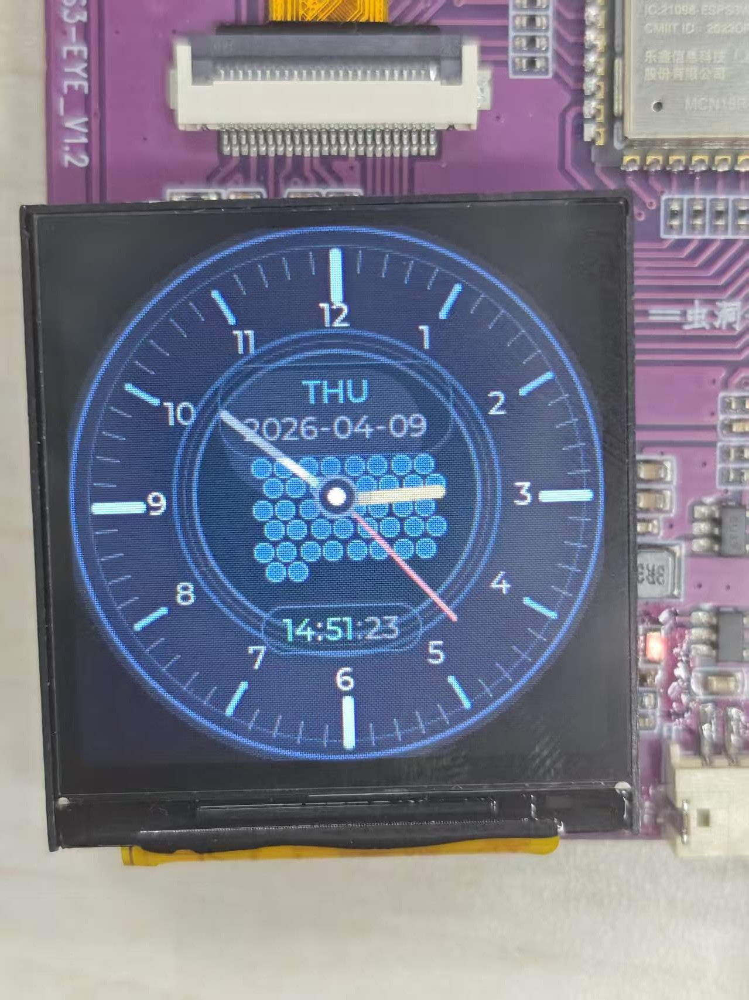

# ESP32-S3 Fluid Watch Face

[中文说明](./README.md)

[](https://github.com/espressif/esp-idf)
[](https://www.espressif.com/en/products/socs/esp32s3)
[](https://lvgl.io/)
[](https://github.com/espressif/esp-bsp)
[](./LICENSE)

An ESP32-S3 watch face application featuring a real-time SPH fluid simulation that reacts to accelerometer tilt. It combines an analog watch face, digital time/date, and an interactive LVGL fluid canvas.

## 📷 Screenshots



## Overview

This project targets the **ESP32-S3-EYE** board and uses **ESP-IDF + LVGL** to build a smartwatch-style UI. The fluid effect is driven by accelerometer input and updated at 30 Hz for responsive motion.

## ✨ Features

- Analog clock hands for hour, minute, and second
- Digital time, date, and weekday display
- Real-time SPH fluid simulation rendered on an LVGL canvas
- Tilt-driven interaction with deadzone, clamp, and low-pass filtering
- Auto-detection for multiple accelerometers:
  - QMA7981
  - MPU6050
  - LIS3DH / SC7A20
- Button fallback when no accelerometer is available
- WiFi + SNTP time synchronization

## 🛠️ Tech Stack

| Item | Value |
|---|---|
| MCU | ESP32-S3 |
| Board | ESP32-S3-EYE |
| Framework | ESP-IDF 5.4.3 |
| UI | LVGL |
| Input | I2C accelerometer + button fallback |
| Networking | WiFi / SNTP |

## 📦 Prerequisites

- ESP-IDF 5.4.3
- ESP32-S3-EYE board
- Serial connection to the device
- Optional supported accelerometer on I2C

## 🚀 Quick Start

### 1. Activate ESP-IDF

```bat
D:\Espressif\frameworks\esp-idf-v5.4.3\export.bat
```

### 2. Build

```bat
idf.py set-target esp32s3
idf.py build
```

### 3. Flash and monitor

```bat
idf.py -p COM7 flash monitor
```

### 4. Configure WiFi credentials

Edit `main/main.c` before building:

```c
#define WIFI_SSID "your_ssid"
#define WIFI_PASS "your_password"
```

## Usage

After flashing:

1. Boot the device.
2. Wait for WiFi and SNTP synchronization.
3. Tilt the board to move the fluid.
4. If no IMU is detected, use the board buttons for fallback input.

## 📁 Project Structure

```text
watch_face2/
├── main/
│   ├── main.c           # App entry, WiFi/SNTP, timers, fluid input processing
│   ├── watch_ui.c       # LVGL watch face UI and fluid canvas container
│   ├── watch_ui.h
│   ├── fluid_sim.c      # SPH simulation and particle rendering
│   ├── fluid_sim.h
│   ├── accel_input.c    # Sensor detection and raw accelerometer polling
│   ├── accel_input.h
│   └── CMakeLists.txt
├── CMakeLists.txt
├── partitions.csv
├── dependencies.lock
├── CLAUDE.md
├── README.md            # Chinese README
└── README_EN.md         # English README
```

## Architecture

### Data Flow

```text
accel_input.c -> main.c -> watch_ui.c -> fluid_sim.c
```

### Input Pipeline

```text
Raw accel -> bias calibration -> deadzone -> clamp -> input curve -> low-pass filter -> fluid simulation
```

### Fluid Simulation Notes

The simulation uses:

- Poly6 kernel for density
- Spiky gradient for pressure force
- Viscous Laplacian for viscosity
- Spatial hashing grid for neighbor lookup
- XSPH smoothing for more stable motion

Key parameters are defined at the top of `main/fluid_sim.c` and `main/main.c`.

## 🤝 Contributing

1. Fork this repository
2. Create a branch
3. Commit your changes
4. Open a pull request

## 📄 License

This project is licensed under the [MIT License](./LICENSE).
